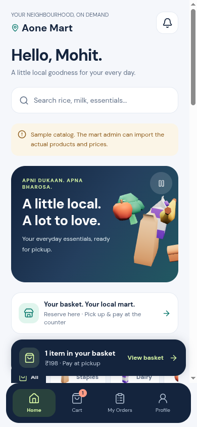
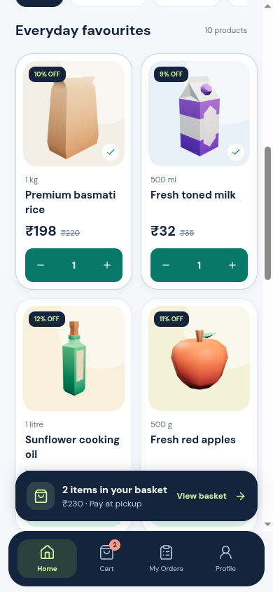
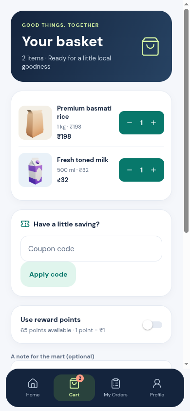
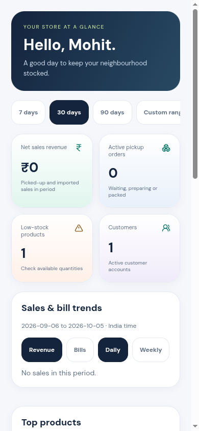
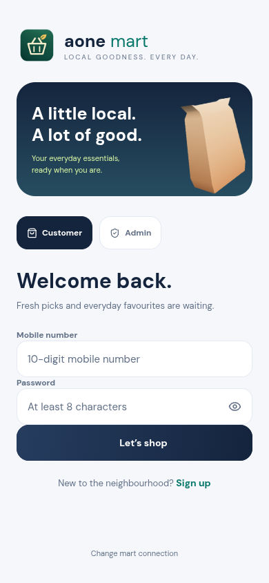
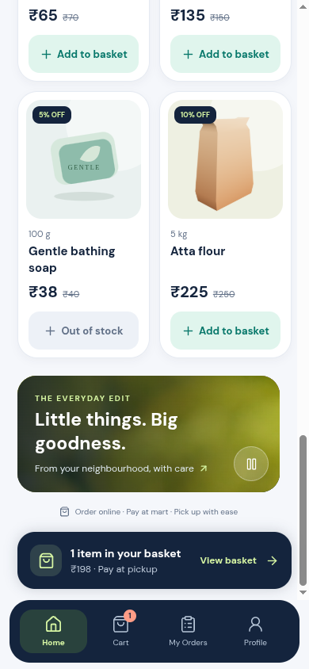

# Aone Mart 1.1 visual refresh

Navy, teal, mint, lime and coral replace the cream/green palette. Rounded product cards use real catalog prices, original image URLs with `contain`, cached images and 1024×1024 local category illustrations when a photo is missing. Imported or remote photos are not replaced with an unrelated product photograph. Existing low-resolution source photos cannot gain detail simply by resizing them; the admin can supply an original high-resolution product URL.

The Home hero includes a Three.js scene built from Kenney's CC0 Food Kit models. Uploaded store banners stay ahead of the branded 3D slide. A muted Full HD produce clip appears after the products. Customer navigation, shared controls, quantities, cart badges, screen entrances and confirmed-order success have short animations. Android-native switches retain their built-in feedback. Motion respects the system's reduced-motion setting and app activity. The 3D scene caps rendering near 30 fps, cancels animations and disposes geometry/materials when stopped. Video does not play behind another screen or outside the viewport. Both have local image fallbacks and pause controls.

## Asset provenance

- [Kenney Food Kit 2.0](https://kenney.nl/assets/food-kit), CC0. Original license is preserved in `apps/mobile/assets/models/KENNEY-LICENSE.txt`. Selected OBJ meshes and their palette colours are baked into `groceries.json` as positions, normals and linear vertex colours. Native rendering requires no remote models, browser texture loaders or external texture requests. PNG illustrations are original 1024×1024 Three.js renders of those models, rather than the kit's 64-pixel preview thumbnails. The soap illustration is a resolution-independent SVG.
- Kindel Media's Pexels fresh-cucumber footage: source, adaptation and license in `apps/mobile/assets/motion/LICENSE.md`.
- Existing Aone Mart brand artwork remains in use.

## Local visual preview

After `npm ci`, run `npm run preview:ui` from the repository root, then open `http://127.0.0.1:4173/`. Optional routes: `/?screen=auth`, `/?screen=admin`. The sample catalog is labelled in the UI; all data and API responses in this harness are fixtures. Actual customer components, cart state and dialogs render via React Native Web. Router, keyboard, secure storage, realtime and the native GL surface have preview-only adapters in `scripts/ui-preview`. No preview fixtures or adapters are imported by the APK. The harness catches only browser autoplay promises cancelled by a removed/paused video element, which Expo Video’s web adapter leaves unhandled; other errors remain visible. This preview checks layout and interaction; it does not establish Android-native keyboard, GL, video or device performance behavior.

The `/render` page exposes `window.captureAll()` to regenerate 1024-pixel model illustrations with Three.js in a WebGL-capable browser. The capture endpoint binds only to localhost, accepts whitelisted names, and writes only the corresponding local PNGs. Restart the server after changes to the render entry point; request `/rebuild` to rebuild the UI bundle after source edits.

## Native release

Mobile version is 1.1.1 / Android version code 7. `expo-video` adds a native module, so this refresh requires a new development/release build; a JavaScript-only update cannot add the player to an old installed APK. Expo config disables background video and picture-in-picture.

SwilERP synchronization remains deferred. Invoice, stock, reservation, pickup and payment semantics are unchanged.

## Verification

- Backend tests: 35 passed. Mobile upload regression tests: 5 passed. Native Three/Anime compatibility tests: 4 passed.
- Mobile/API typechecks and API build passed; mobile lint passed with no warnings. Expo dependency compatibility check and Android prebuild passed. Android Hermes export includes the new model images, Full HD clip and poster.
- Preview checks: 320, 390 and 1280 pixel layouts; category filters and empty search; quantity changes, cart totals, coupon quote, successful checkout/cart clearing and order list; auth/admin rendering; five custom banners plus the branded slide; Full HD video metadata and pause/resume; offscreen media disposal; reduced-motion fallback. Browser previews use fixtures and native adapters as described above.
- All 11 generated PNGs are 1024×1024; all 10 model buffers have complete, finite positions/normals/colours.
- A signed APK and physical-device GL/video/keyboard/performance checks were not performed in this workspace. The included screenshots show the fixture-backed browser preview, not a running Android device.

## Preview gallery (sample data)

